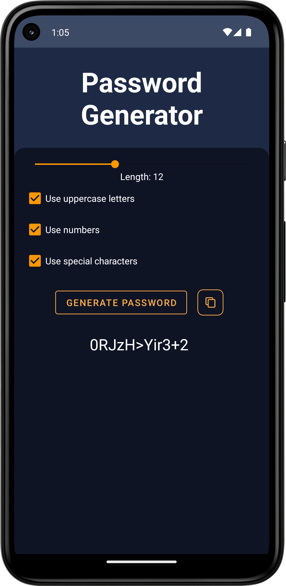
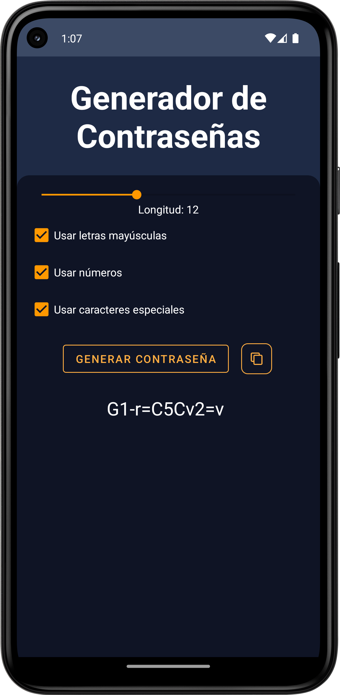

# Password Generator

Password Generator is a simple and easy-to-use Android app that helps you generate strong and secure passwords based on your preferences.

This app was made with GPT4 in a day.

## Features

- Customize password length
- Include uppercase letters
- Include numbers
- Include special characters
- Automatically generate a password when changing settings
- Copy the generated password to the clipboard

## Screenshots

## How to use

1. Open the app and use the slider to set the desired password length.
2. Check or uncheck the options for including uppercase letters, numbers, and special characters according to your preferences.
3. The generated password will be displayed in the text field below the options.
4. Click the "Generate Password" button to generate a new password with the current settings.
5. Click the "Copy" button to copy the generated password to your clipboard.

## License

This project is licensed under the Do What The F*ck You Want To Public License - see the [LICENSE](LICENSE) file for details.
